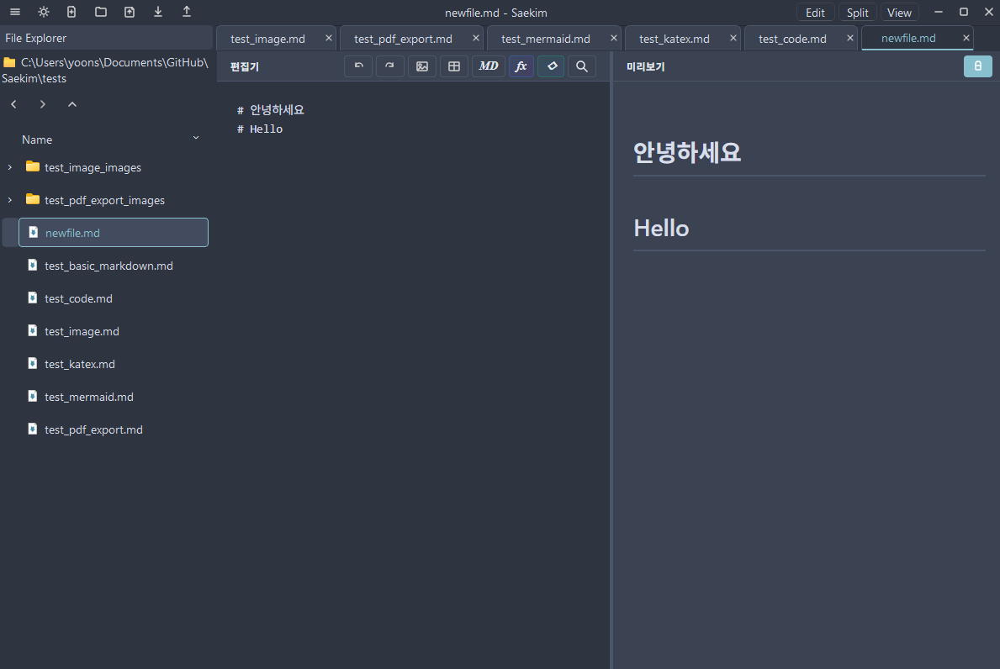

# 새김 (Saekim) - 마크다운 에디터


> 코드와 다이어그램을 자유롭게 다루는 개발자를 위한 로컬 마크다운 에디터

> 3.0.0 개발 브랜치는 Tauri 기반 런타임으로 전환 중입니다. 3.0.0 MVP에서는 PDF 내보내기를 운영체제 인쇄 대화상자로 처리하며, PDF를 Markdown으로 가져오는 기능은 후속 릴리스로 연기되었습니다.

## 📝 프로젝트 소개

**새김(Saekim)**은 개발자와 학생을 위한 **로컬 우선(Local-First)** 마크다운 에디터입니다.
온라인 에디터의 프라이버시 우려를 해결하고, 코드 작성과 문서화를 하나의 통합 환경에서 처리할 수 있도록 설계되었습니다.

### 개발 동기

#### 1. **프라이버시 보호**
- 기존 온라인 에디터들은 사용자 데이터를 서버에 저장하거나 분석에 활용
- 민감한 코드나 연구 노트를 안전하게 로컬 환경에서 관리 가능

#### 2. **개발자 친화적 환경**
- 코드 하이라이팅, 다이어그램, 수식을 하나의 도구로 통합
- 학습 노트, 기술 문서, API 문서 작성에 최적화

#### 3. **오프라인 작업**
- 인터넷 연결 없이도 모든 기능 사용 가능
- PDF 변환도 로컬에서 처리 (외부 API 불필요)

#### 4. **오픈소스 철학**
- 모든 코드와 의존성을 투명하게 공개
- 커뮤니티 기여와 개선 가능

---

## ✨ 주요 기능

### 📄 편집 및 미리보기
- **실시간 렌더링**: Split View, 자동 스크롤 동기화, 라이브 업데이트
- **코드 하이라이팅** (Highlight.js 11.9.0): Python, JavaScript, Java, C++, CSS 등 9개 언어 지원
- **다이어그램 렌더링** (Mermaid.js 10.6.1): Flowchart, Sequence, Class, State, ER, Gantt 등 9종 지원
- **수학 수식** (KaTeX 0.16.9): 인라인/블록 수식, LaTeX 문법 완전 지원



### 📁 파일 관리
- **멀티탭 편집**: 여러 파일 동시 작업, 탭 간 빠른 전환 (Ctrl+Tab)
- **세션 관리**: 자동 세션 저장 및 복원, 마지막 작업 상태 유지
- **파일 새로고침**: 외부 파일 변경 자동 감지 (F5로 수동 새로고침 가능)

### 🔄 문서 변환
- **Markdown → PDF**: 3.0.0에서는 운영체제 인쇄 대화상자의 PDF 저장 기능 사용
- **PDF → Markdown**: 2.x PyQt 런타임 기능이며, 3.0.0 Tauri MVP에서는 제외

### 🎨 테마 시스템
4가지 프리셋 테마 제공: **Nord**, **Catppuccin mocha**, **white**, **black**
- 에디터, 미리보기, 코드 블록 테마 자동 매칭

### 🔍 찾기 및 바꾸기
- 대소문자 구분, 단어 단위 검색, 정규표현식 지원
- 단일/모두 바꾸기 기능 (Ctrl+F)

### 🛠️ 편의 기능
- **마크다운 문법 도우미** (Ctrl+Shift+D): 제목, 리스트, 링크, 표 등 빠른 삽입
- **수식 삽입 도우미**: 분수, 적분, 행렬, 그리스 문자 등 LaTeX 템플릿
- **다이어그램 삽입 도우미** (Ctrl+Shift+M): Mermaid 다이어그램 템플릿

---

## 🆕 What's New in v1.2.0 (2025-12-23)

### ✨ 주요 업데이트

#### UI/UX 개선
- **리사이즈 오버레이**: 창 크기 조정 중 "크기 조정 중..." 메시지 표시로 검은 화면 문제 해결
- **Pretendard 폰트 번들링**: 시스템 폰트 의존성 제거, 일관된 타이포그래피
- **ViewToggle 버튼 스타일 개선**: Edit/View/Split 버튼의 활성/비활성 상태 명확히 구분

#### 파일 새로고침 기능
- **수동 새로고침**: F5 단축키 및 툴바 새로고침 버튼
- **자동 새로고침**: QFileSystemWatcher로 외부 파일 변경 자동 감지

### 🐛 버그 수정
- 창 크기 조정 시 에디터/프리뷰 영역이 검게 변하는 문제 해결
- Edit/View 버튼 선택 상태가 불명확했던 문제 개선

**전체 변경사항**: [📝 CHANGELOG.md](CHANGELOG.md)

---

## 🚀 설치 및 실행

새김을 사용하는 방법은 **두 가지**가 있습니다:

### 방법 1: 실행 파일 다운로드 (권장) ⚡

**가장 빠르고 간편한 방법입니다!**

1. **[GitHub Releases 페이지](https://github.com/beeean17/Saekim/releases) 방문**
2. **최신 버전 다운로드**:
   - **Windows**: `Saekim-v1.2.0-windows.exe`
   - **macOS**: `Saekim-v1.3.0-macos.pkg` (미서명·미노타라이즈)
   - **Linux**: 현재 실행 파일 미제공 (→ 방법 2 참조)
3. **다운로드한 파일 실행**
4. **바로 사용 가능!** - Python 설치나 의존성 설치 불필요

**장점**:
- ✅ Python 설치 불필요
- ✅ 의존성 관리 불필요
- ✅ 클릭 한 번으로 실행
- ✅ 초보자 친화적

#### ⚠️ Windows 설치 시 보안 경고 안내

실행 파일을 처음 다운로드하거나 실행할 때 Windows에서 **"알 수 없는 게시자"** 또는 **Windows Defender SmartScreen** 경고가 표시될 수 있습니다.

**이는 정상입니다!** 새김은 현재 유료 코드 서명 인증서를 사용하지 않기 때문에 이러한 경고가 나타납니다.

**안전하게 설치하는 방법**:
1. Windows Defender SmartScreen 창에서 **"추가 정보"** 클릭
2. **"실행"** 또는 **"다운로드 유지"** 버튼 클릭
3. 설치 프로그램이 정상적으로 실행됩니다

**새김의 안전성**:
- ✅ 완전한 오픈소스: [모든 소스코드](https://github.com/beeean17/Saekim) 공개
- ✅ 악성코드 없음: 직접 소스코드 확인 가능
- ✅ 로컬 우선: 인터넷 연결 없이도 모든 기능 사용
- ✅ 데이터 수집 없음: 사용자 데이터를 외부로 전송하지 않음

코드 서명 인증서는 연간 \$100~$500의 비용이 들기 때문에, 오픈소스 프로젝트에서는 일반적으로 사용하지 않습니다. 프로젝트가 성장하면 무료 오픈소스 코드 서명 프로그램(SignPath.io 등)을 통해 인증서를 추가할 예정입니다.

#### ⚠️ macOS 설치 시 보안/서명 안내

- 제공 파일: `Saekim-v1.3.0-macos.pkg` (미서명, 미노타라이즈)
- PDF 내보내기는 앱에 포함된 Qt WebEngine 렌더러를 사용하므로 별도 Chromium 다운로드가 필요하지 않습니다.
- Gatekeeper 우회(미서명 PKG 실행):
   1) PKG 실행 시 차단되면 **시스템 설정 > 개인정보 보호 및 보안**에서 경고 알림의 **열기** 또는 **Open Anyway** 선택
   2) 다시 실행 후 **열기**를 눌러 설치 진행
   3) 설치 완료 후 `Saekim.app` 실행
- 현재 유료 서명/노타를 적용하지 않았으므로 보안 경고가 표시될 수 있습니다. 향후 서명/노타 적용 시 릴리스 노트로 안내 예정입니다.

---

### 방법 2: 소스코드에서 실행 (개발자용) 🔧

**코드를 수정하거나 기여하고 싶은 경우 이 방법을 사용하세요.**

#### 시스템 요구사항

| 항목 | 요구사항 |
|------|---------|
| **Python** | 3.10 이상 (3.11 권장) |
| **운영체제** | Windows 10/11, macOS, Linux |
| **메모리** | 최소 4GB RAM |
| **디스크** | 500MB 이상 여유 공간 |

#### 설치 단계

```bash
# 1. 저장소 클론
git clone https://github.com/beeean17/Saekim.git
cd Saekim

# 2. 가상환경 생성 (권장)
python -m venv venv
venv\Scripts\activate  # Windows
# source venv/bin/activate  # macOS/Linux

# 3. 의존성 설치
pip install -r requirements.txt

# 4. 2.x PyQt 앱 실행
python src/main.py

# 5. 3.0.0 Tauri 앱 실행
corepack enable
corepack pnpm install
corepack pnpm tauri:dev
```

**주요 의존성**:
- PyQt6 >= 6.6.0 (GUI 프레임워크)
- PyQt6-WebEngine >= 6.6.0 (내장 브라우저)
- PyMuPDF >= 1.24.0 (PDF 처리)
- pdfplumber >= 0.11.0 (PDF 텍스트 추출)

---

## 📖 문서

### 사용 가이드
자세한 사용법은 [📖 USAGE.md](USAGE.md)를 참고하세요:
- 인터페이스 가이드 (툴바, 사이드바, 메뉴)
- 키보드 단축키 전체 목록
- 마크다운 작성 가이드
- 코드 블록 및 다이어그램 작성법
- 수식 작성법 (KaTeX)
- 테마 변경 및 커스터마이징
- 파일 변환 및 내보내기

### 변경 사항
버전별 변경사항은 [📝 CHANGELOG.md](CHANGELOG.md)를 참고하세요.

---

## 🏗️ 프로젝트 구조

```
Saekim/
├── src/
│   ├── main.py                 # 앱 진입점
│   ├── backend/
│   │   ├── converter.py        # PDF ↔ Markdown 변환기
│   │   ├── file_manager.py     # 파일 시스템 관리
│   │   └── session.py          # 세션 저장/복원
│   ├── ui/
│   │   ├── editor.py           # 마크다운 에디터
│   │   ├── preview.py          # 웹뷰 미리보기
│   │   └── dialogs/            # 대화상자 모음
│   ├── windows/
│   │   ├── main_window.py      # 메인 윈도우
│   │   └── title_bar.py        # 커스텀 타이틀바
│   └── resources/
│       ├── themes/             # QSS 테마 파일
│       ├── fonts/              # Pretendard 폰트
│       ├── icons/              # 아이콘 리소스
│       └── html/               # 미리보기 템플릿
├── requirements.txt            # Python 의존성
├── USAGE.md                    # 사용 가이드
├── CHANGELOG.md                # 변경 사항 기록
└── LICENSES.md                 # 라이센스 정보
```

## 📜 라이센스

이 프로젝트는 **AGPL-3.0 라이센스** 하에 배포됩니다.

**주요 의존성 라이센스**:
- PyQt6: GPL-3.0
- PyQt6-WebEngine: GPL-3.0
- PyMuPDF: AGPL-3.0
- Marked.js, Highlight.js, Mermaid.js, KaTeX: MIT
- Pretendard 폰트: SIL OFL-1.1

자세한 내용은 [LICENSES.md](LICENSES.md)를 참고하세요.

---

## 🤝 기여하기

기여는 언제나 환영합니다!

### 기여 방법

1. **Fork** 이 저장소
2. **Feature 브랜치** 생성 (`git checkout -b feature/AmazingFeature`)
3. **변경사항 커밋** (`git commit -m 'Add some AmazingFeature'`)
4. **브랜치에 Push** (`git push origin feature/AmazingFeature`)
5. **Pull Request** 열기

### 개발 가이드라인

- 코드 스타일: PEP 8 준수
- 커밋 메시지: 명확하고 간결하게 작성
- 테스트: 새로운 기능에 대한 테스트 코드 작성 권장
- 문서화: 주요 변경사항은 CHANGELOG.md에 기록

### 버그 리포트 및 기능 제안

[GitHub Issues](https://github.com/beeean17/Saekim/issues)에서 버그 리포트나 기능 제안을 남겨주세요.

---

## 📧 문의

- **개발자**: [beeean17](https://github.com/beeean17)
- **이슈 트래커**: [GitHub Issues](https://github.com/beeean17/Saekim/issues)
- **라이센스 문의**: LICENSES.md 참조

---

## 🙏 감사의 말

이 프로젝트는 다음 오픈소스 프로젝트들의 도움을 받았습니다:

- [PyQt6](https://www.riverbankcomputing.com/software/pyqt/) - GUI 프레임워크
- [Marked.js](https://marked.js.org/) - Markdown 파싱
- [Highlight.js](https://highlightjs.org/) - 코드 하이라이팅
- [Mermaid.js](https://mermaid.js.org/) - 다이어그램 렌더링
- [KaTeX](https://katex.org/) - 수식 렌더링
- [PyMuPDF](https://pymupdf.readthedocs.io/) - PDF 처리
- [Pretendard](https://github.com/orioncactus/pretendard) - 한글 폰트

---

**Made by [beeean17](https://github.com/beeean17)**
