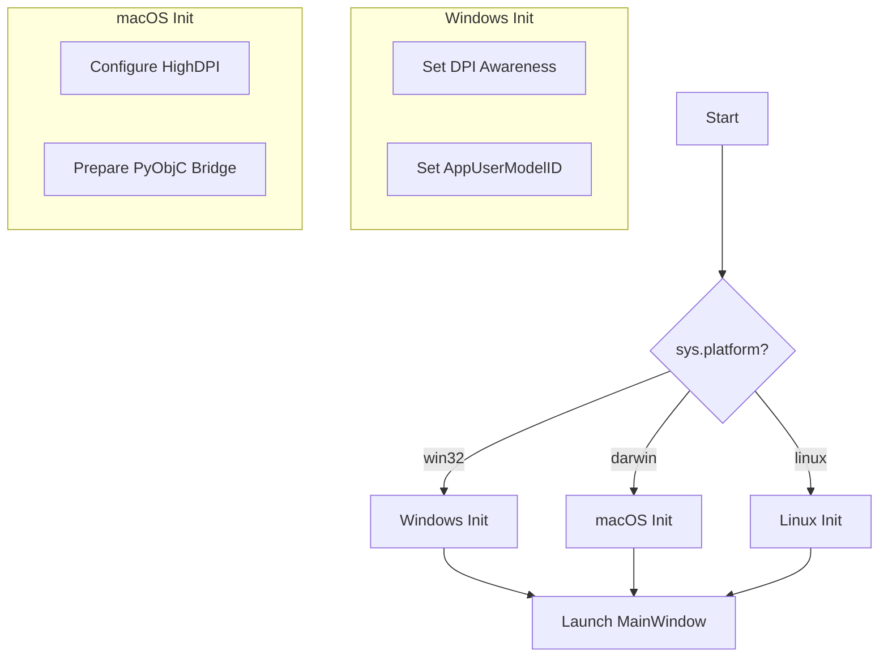

# System Architecture Document: macOS Support

> **Version**: 1.0  
> **Date**: 2026-01-17  
> **Status**: Draft  
> **PRD**: [prd-macos-support.md](./prd-macos-support.md)

---

## 1. Architectural Goals

1.  **Cross-Platform Window Abstraction**: Decouple window management from OS-specific APIs.
2.  **Platform-Agnostic Entry Point**: Ensure `main.py` handles platform differences gracefully.
3.  **Secure Distribution Pipeline**: Automate code signing and notarization for trusted delivery.
4.  **Zero-Change Backend**: Maintain existing backend logic for full compatibility.

---

## 2. Component Design

### 2.1 Window Management System

#### Current Architecture (Problem)
The `MainWindow` class in `src/windows/main_window.py` directly calls `ctypes.windll` methods for window styling, hit-testing, and event handling. This creates a hard dependency on Windows.

#### Target Architecture (Solution)
Introduce a **Window Strategy Pattern** or use a **Cross-Platform Library** to handle window chrome.

**Decision**: Adopt **PyQt6-Frameless-Window** library.
- **Role**: Handles platform-specific "frameless" window behavior (resizing, shadows, moving).
- **Benefit**: Removes ~120 lines of Windows-specific boilerplate; adds macOS support via PyObjC automatically.
- **Integration**: `MainWindow` will inherit from `FramelessMainWindow` instead of `QMainWindow` directly (or manage a delegate).

### 2.2 Application Entry Point (`src/main.py`)

Logic flow will branch based on `sys.platform`:

### 2.3 Build & Packaging System

#### 2.3.1 PyInstaller Specification
A new `saekim_macos.spec` file will be created to handle macOS-specific packaging requirements:
- **Bundle Structure**: Create `Saekim.app`.
- **Resources**: Include `.icns` icon file.
- **Info.plist**: Inject high-DPI keys and version info.
- **Arch**: Target `universal2` (x86_64 + arm64).

#### 2.3.2 Security Pipeline
1.  **Sign**: `codesign` with Hardened Runtime entitlements.
2.  **Notarize**: `xcrun notarytool` submission to Apple.
3.  **Staple**: Attach ticket to the app bundle.

---

## 3. Data Flow Changes

No significant changes to data flow. File I/O and PDF conversion paths remain consistent but utilize platform-specific implementations of underlying libraries:
- **File I/O**: `pathlib` (already cross-platform).
- **PDF Gen**: `Playwright` downloads platform-specific Chromium binary.

---

## 4. Implementation Specifications

### 4.1 New File: `src/resources/icons/app_icon.icns`
- Required for macOS App Bundle icon.
- Generated from existing PNG logo.

### 4.2 Modified File: `src/windows/main_window.py`
- **Class**: Remove `nativeEvent` override.
- **Inheritance**: Change to `FramelessMainWindow` (conditional import if we want to keep strict decoupling, or standard dependency).
- **UI**: Ensure `TitleBar` signals connect to library's methods (`titleBar.windowTitleChanged`, window state changes).

### 4.3 Modified File: `src/main.py`
- Guards around `ctypes` imports.
- macOS specific adjustments if any (e.g., specific `QApplication` attributes).

---

## 5. Deployment Architecture

| Environment | Build Host | Target Output | Distribution |
|-------------|------------|---------------|--------------|
| Dev (Local) | macOS | Source Run | Python `venv` |
| CI/CD (GitHub) | macOS Runner | `.app` / `.dmg` | GitHub Releases |

---

## 6. Compatibility & Constraints

- **Minimum OS**: macOS 10.14 (Mojave) - limit set by PyQt6-WebEngine.
- **Python Version**: 3.10+ (Consistent with Windows).
- **Dependencies**:
    - `PyQt6-Frameless-Window`: New.
    - `PyQt6-WebEngine`: Needs verification on older macOS versions.
    - `Playwright`: Requires internet on first run or bundled browsers (we rely on first-run download).

---

## 7. Approval

- [ ] Architecture aligns with PRD Requirements
- [ ] No regression risks for Windows identified
- [ ] Security model (Notarization) is feasible
